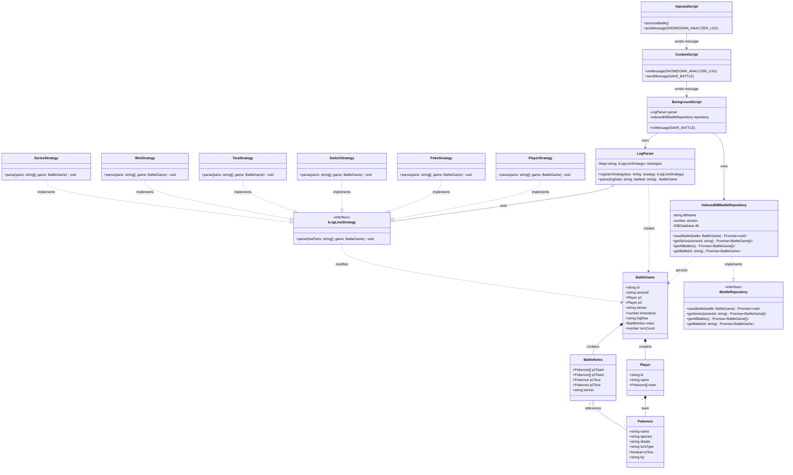
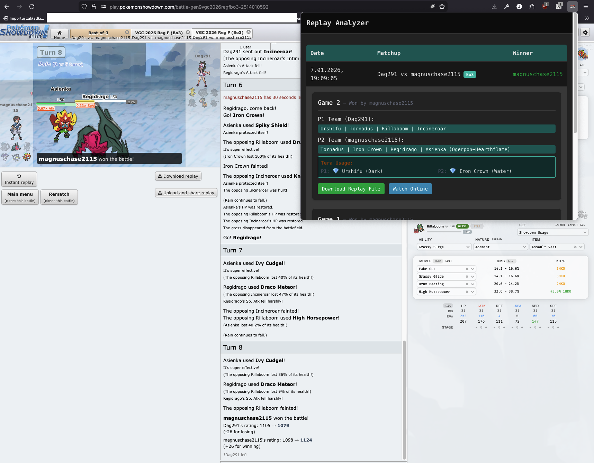

<div align="center">
<h3>Pokemon Showdown Replay Analyzer</h3>
</div>

## Intro

**PS Replay Analyzer** is a browser extension developed primarily for **Firefox** (with Chrome support) that streamlines the collection of Pokemon Showdown battle data.

Instead of manually downloading/uploading the replay, this extension detects when a battle finishes and the "Download Replay" option becomes available. It then automatically captures the replay log, parses the battle data, and stores it locally for you to review later.

## Architecture

The project follows a modular architecture separating concerns between data ingestion, parsing logic, and storage.

### Core Components

- **Content Script & Injected Script**: Observes the DOM for the appearance of the replay download button post-battle. When detected, it generates the replay blob and extracts the raw log.
- **Background Script**: Acts as the central hub, receiving logs, invoking the parser, and persisting data to IndexedDB.
- **Parser Engine**: A strategy-based parser that converts raw text logs into structured `BattleGame` objects.
- **Repository**: An abstraction layer over IndexedDB to manage battle data persistence.

### Class Diagram

Refer to the [Architecture Diagram](./docs/architecture.mmd) for a visual representation of the system's class structure and relationships.



## Design Patterns

This project leverages several software design patterns to ensure maintainability and scalability:

- **Strategy Pattern**: The `LogParser` uses specific strategies (e.g., `PlayerStrategy`, `SwitchStrategy`) to handle different types of log lines (`|player|`, `|switch|`, etc.), allowing for easy extension of parsing logic without modifying the core parser.
- **Repository Pattern**: `IndexedDBBattleRepository` implements `IBattleRepository`, providing a clean abstraction for data access and decoupling the business logic from the underlying storage mechanism (IndexedDB).
- **Observer Pattern**:
  - `MutationObserver` is used in the content script to watch for DOM changes (specifically the appearance of the download button).
  - The extension uses Chrome's messaging system to publish events (like log capture) that the background script subscribes to.
- **Inversion of Control (IoC)**: The `LogParser` acts as a central coordinator that delegates specific tasks to registered strategies, promoting loose coupling.

## Features

- **React 19**
- **TypeScript**
- **Tailwind CSS 4**
- **Vite**
- **IndexedDB** for local storage
- **Strategy-based Log Parsing**

## Usage

### Developing and Building

This project is configured to support both Firefox and Chrome.

1. **Install Dependencies**:

   ```bash
   npm install
   # or
   yarn
   ```

2. **Development (Watch Mode)**:
   Running a `dev` command will build your extension and watch for changes in the source files.

   **For Firefox (Recommended):**

   ```bash
   npm run dev:firefox
   # or
   yarn dev:firefox
   ```

   This will output to `dist_firefox`.

   **For Chrome:**

   ```bash
   npm run dev:chrome
   # or
   yarn dev:chrome
   ```

   This will output to `dist_chrome`.

3. **Production Build**:
   To create an optimized production build:

   ```bash
   npm run build:firefox  # Output: dist_firefox
   npm run build:chrome   # Output: dist_chrome
   ```

### Loading the Extension

#### For Firefox

1. Open Firefox and navigate to `about:debugging#/runtime/this-firefox`.
2. Click **Load Temporary Add-on**.
3. Navigate to the `dist_firefox` folder in this project.
4. Select the `manifest.json` file.

#### For Chrome

1. Open Chrome and navigate to `chrome://extensions`.
2. Enable **Developer mode** (toggle in the top right).
3. Click **Load unpacked**.
4. Select the `dist_chrome` folder in this project.

## Examples

Check out the `examples/` directory for visual demonstrations:

- **Automatic log extraction & parsing**:
  

- **Generated static replay file**:
  
